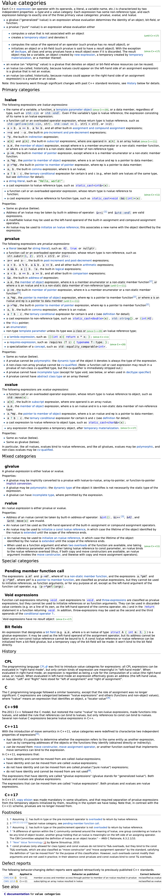

Input:
- small && "sink": by value
- all others: by const&

Output: by value


## Value Categories

**K&R C**

```cpp
int i;
i = 42;     // OK
42 = i;     // ERROR
```

`i` is lvalue, OK on *left-hand side* of an assignment

`42` is rvalue, only *right-hand side* of an assignment

Can take the address of an lvalue, but not an rvalue

```cpp
int *p = &i;    // OK for lvalue only
int *q = &42;   // ERROR
```

**ANSI C**

```cpp
const int c = 0;
c = 42;             // ERROR => no lvalue
const int *r = &c;  // OK    => lvalue
```

Now `c` cannot be on the left side, but can be taken address

So `c` is lvalue: *localizable* value

rvalue: *read-only* value ("roughly")

**C++11**

```cpp
std::string s;
std::move(s) = "hello";     // OK    => lvalue
auto sp = &std::move(s);    // ERROR => no lvalue
```

So the decision is, `std::move()` is xvalue, a bit like lvalue, a bit like rvalue, most of rvalue rules apply to xvalue. Then rename original rvalue to prvalue, and let rvalue represent both


- LValue: Localizable value, (everything that has a *name* and *string literals*):
  - Variable, data member, function, string literal, returned lvalue reference
  - Can be on the left side of an assignment only if it's modifiable
- PRValue: Pure RValue (former RValue), (*temporaries* and *other literals*):
  - All literals except string literals (`42`, `true`, `nullptr`, ...), `this`, lambda, returned non-reference, result of constructor call (`T(...)`)
- XValue: eXpiring value, (value from `std::move()`):
  - Returned rvalue reference (e.g. by `std::move()`), cast to rvalue reference

**C++17**

- prvalue perform *initialization*
  - No temporary object yet
- glvalue produce locations
- Materialization as a temporary object:
  - prvalue-to-xvalue conversion

### Type versus Value Category

```cpp
void passRValueRef(std::string &&s); // can only pass rvalues, and s is not const

std::string s;          // s is lvalue
passRValueRef(s);       // ERROR: cannot bind lvalue to rvalue reference
const std::string &cs;  // cs is lvalue
passRValueRef(cs);       // ERROR: cannot bind lvalue to rvalue reference
passRValueRef("hello"); // OK (string literal (lvalue) converted to std::string (prvalue))
passRValueRef(std::string{"hello"});    // OK (can pass prvalue)
passRValueRef(std::move(s));            // OK (can pass xvalue)

void passRValueRef(std::string &&s) { // s has type std::string &&, value category lvalue
    passRValueRef(s);   // ERROR: cannot bind lvalue to rvalue reference
    passRValueRef(std::move(s));    // OK (can pass xvalue)
    // but std::move is a cast, casts s back to its own type: static_cast<std::string &&>(s)
}
```

```cpp
template <typename T>
void passRValueRef(T&& s);  // universal reference/forwarding reference, s can be const

std::string s;          // s is lvalue
passRValueRef(s);       // OK
const std::string cs;   // cs is lvalue
passRValueRef(cs);      // OK
```

```cpp
template <typename T>
void passRValueRef(typename T::iterator &&);    // follows first rule, it is not forwarding reference

std::string::iterator pos1;     // s is lvalue
passRValueRef(pos1);            // ???
const std::string::iterator pos2;   // cs is lvalue
passRValueRef(pos2);            // ???
```

Rejected syntax for universal references

```cpp
template <typename T>
void passRValueRef(T&&& s);
// Overloading syntax with different sematics is cool for experts, a nightmare for application programmers, but who cares
```

### When Scott and Herb Give Different Advice

Herb's style, *no claim* to move, *guarantee* to move

```cpp
void sink(std::unique_ptr<MyType> up);  // sink() gets ownership in up

std::unique_ptr<MyType> up(new MyType);

sink(std::move(up));    // up loses ownership
sink(up);               // ERROR: because copying of type of up is deleted
```

Scott's style, *claim* to possibly move, *no guarantee* to move

```cpp
void sink(std::unique_ptr<MyType>&& up);    // up refers to passed argument

std::unique_ptr<MyType> up(new MyType);

sink(std::move(up));    // up might lose ownership
sink(up);               // ERROR: due to declaration of sink()
```

Herb more agree to Scott's style


