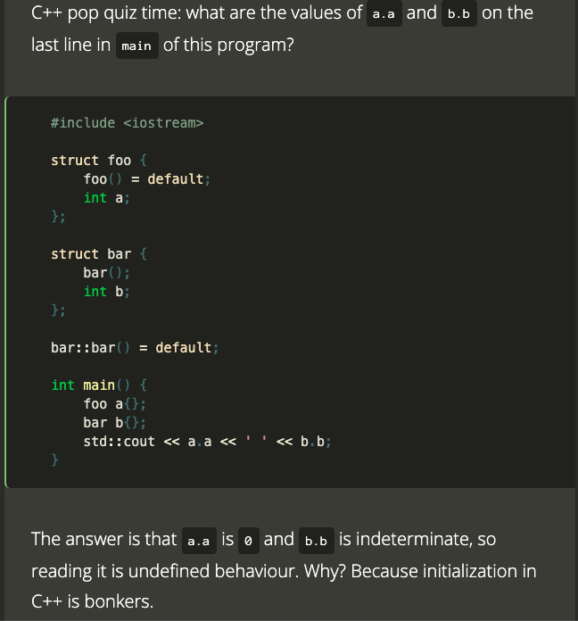

>We get a mess, the mess get worse, so it's time to switch to a new language. -- Nicolai Josuttis

- [Initialization of C++ is Bonkers](#initialization-of-c-is-bonkers)
  - [Default initialization](#default-initialization)
    - [Syntax](#syntax)
    - [Examples & Traps](#examples--traps)
    - [Summary](#summary)
  - [Copy initialization](#copy-initialization)
    - [Syntax](#syntax-1)
    - [Summary](#summary-1)
  - [Aggregate intialization](#aggregate-intialization)
    - [Syntax](#syntax-2)
    - [Examples & Traps](#examples--traps-1)
    - [Summary](#summary-2)
  - [Direct initialization](#direct-initialization)
    - [Syntax](#syntax-3)
    - [Examples & Traps](#examples--traps-2)
    - [Summary](#summary-3)
  - [Value initialization](#value-initialization)
    - [Syntax](#syntax-4)
    - [Examples & Traps](#examples--traps-3)
    - [Summary](#summary-4)
  - [List initialization](#list-initialization)
    - [Syntax](#syntax-5)
    - [Traps](#traps)
    - [Summary](#summary-5)
  - [Summary](#summary-6)
  - [Seeking for better code guide](#seeking-for-better-code-guide)
  - [The Future](#the-future)
  - [Conclusion](#conclusion)
  - [Reference](#reference)

# Initialization of C++ is Bonkers



Intializer may be one of the following

1. `()`
2. `=`
3. `{}`

Depending on the context, it may invoke:

1. Default initialization
5. Copy initialization
2. Value initialization
3. Aggregate initialization
4. Direct initialization
6. List initialization

==Different C++ standard may have different rules==

## Default initialization

This is the initialization performed when a variable is constructed with no initializer.

### Syntax

```cpp
T object;
new T;
new T(); // until C++03
```

### Examples & Traps

```cpp
int i;
int j = i;  // UB
```

However, `unsigned char` is an exception

```cpp
unsigned char i;
unsigned char j = i; // no undefined
```

For `struct` in C/C++, and `class` in C++, **default initalization** does not initialize anything by default

```cpp
struct S {
    int i;
};

S s;    // calls implicit default ctor
int j = s.i;    // UB
```

```cpp
class C {
    int i;
public:
    C() {}
    int getI() { return i; }
};

C c;
int j = c.getI();   // UB
```

If T is a const-qualified type, it must be a class type with a ==user-provided== default constructor.

A constructor is **user-provided if** it is user-declared and not explicitly defaulted on its first declaration.

```cpp
const int i;    // Error

struct S {
    int i;
};
const S s;      // Error

struct X {
    X() = default;      // user-declared, but not user-provided
    int i;
};
const X x;      // Error

struct Y {
    Y();
    int i;
};
Y::Y() = default;
const Y y;      // OK
```

### Summary

- built-in types: uninitialized, UB on access
- class types: default constructor

To avoid UB, use Direct Member Initialization whenever possible

```cpp
struct S {
    int i = 0;
    W w = {};
};
```

## Copy initialization

Initializes an object from another object

### Syntax

```cpp
T object = other;
T object = {other}; // until C++11
T array[N] = {other};
f(other)
return other;
throw object;
catch (T object)
```

- initializer starts with `=`, or
- Passing arguments by value, or
- Returning by value, or
- Throwing/Catching exceptions by value

### Summary

* **Copy initialization** is never an assignment
* If type don't match, **copy initialization** performs a conversion sequence, but explicit ctors are not participate

  ```cpp
  struct S {
  	explicit S(int);
  };
  
  void foo(const S &);
  
  foo(42);	// error
  
  S s1(42);
  S s2{42};
  S s3 = 42;	// error
  S s4 = {42};	// error
  ```

* The implicit conversion must produce T directly from the initializer.

  ```cpp
  struct S {
      S(std::string);
  };
  S s1 = "hello"    // Error, no conversion from const char [6] to std::string
  S s2 = ("hello"); // ditto, only const char * to std::string

  S s3("hello");    // OK
  S s4 = {"hello"}; // OK, different rules apply
  S s5{"hello"};    // OK
  ```

## Aggregate intialization

Initializes an aggregate from braced-init-list

### Syntax

```cpp
T object = {arg1, arg2, ...};
T object {arg1, arg2, ...}; // since C++11
```

* An array, or
* A class (struct/union), that has
  - C++98
    * no user-declared ctors
    * no private or protected non-static data members
    * no base class
    * no virtual functions
  - C++11/14
    * no user-provided ctors
    * no private or protected non-static data memebers
    * no base class
    * no virtual functions
    * no default member initializers
  - C++17
    * no user-provided, explicit, or inherited ctors
    * no private or protected non-static data members
    * no virtual, private, or prtected base class
    * no virtual functions

### Examples & Traps

Aggregate definition got relaxed standard after standard

```cpp
struct Data {
	std::string name;
	double value;
};

struct DV: Data {	// before C++17, this is a class with default ctor
	bool used;		// since C++17, this is an aggregate
	void print() const;
};

DV u;	// value and used are undefined
DV v{};	// value and used with 0 and false
DV v{{"hello", 3}, true};
DV v{"hello", 3, true};
```

Aggregate initialization **copy init** its member

```cpp
struct S {
    explicit S(int);
};

struct A {
    S s1, s2;
};

S s = {3, 4}; // Error, because S(int) is explicit
```

```cpp
struct S {
    explicit S(int);
    S(double);
};

S s = {3, 4}; // calls S(double)
```

Aggregate initialzation **zero init** its remaining elements

```cpp
struct S {
    int i, j;
};

S s = {1};         // s.i = 1, s.j = 0

int a[100] = {};    // all zeros
```

Brace elision

```cpp
struct S {
    int i, j;
};

struct A {
    S s;
    int k;
};

A a = {1, 2}; // A a = {{1, 2}, 0}
```

```cpp
struct S {
	S() = delete; // user-declared, but not user-provided, so since c++11, it is an aggregate
};

S s1;	// error
// WTF of the month -- on Nicolai Josuttis twitter
// Or a nice way to force to initialize an aggregate
S s2{};	// ok since c++11, fixed in C++20
```

```cpp
struct S {
	int i = 0;
	S(int) = delete;
};

S s1(3); // error
S s2{3}; // ok since c++11, fixed in C++20
```

`std::array` is an aggregate, it can be ridiculous
- Without intializaton elements might have **undefined values**
- Nested intializations need an **additional pair of braces**

```cpp
std::array<int, 10> a;      // values are undefined
std::array<int, 10> b{};	// values are initialized with 0
std::array<int, 10> c{1, 2, 3};	// 1, 2, 3, 0, 0, 0...

std::vector<std::complex<double>> x{{1, 2}, {3, 4}};	// fine, it is class, calles the constructor
std::array<std::complex<double>, 10> z{{1, 2}, {3, 4}}; // Error
// struct -> array -> struct same as C
std::array<std::complex<double>, 10> z1{{{1, 2}, {3, 4}}}; // all braces are needed

// getting worse

std::vector<std::complex<double>> x{{1, 2}};	// init the first element
std::array<std::complex<double>, 10> y{{1, 2}}; // something different, 1st is (1, 0), the 2nd is (2, 0)
```

==However==,

```cpp
struct S {
    int i, j;
};

struct X {
    struct S s[10];
};

std::array<S, 10> b = {{3, 4}};
printf("%d %d %d \n", b[0].i, b[0].j); // gives 3, 4, inited correctly
```

==WHY!!!==

### Summary

- Elements without initializers undergo **zero initialization**, thus no undefined behavior

## Direct initialization

Initializes an object from explicit set of constructor arguments.

### Syntax

```cpp
T object(arg1, arg2, ...);
T(arg1, arg2, ...)
```

### Examples & Traps

```cpp
std::string s(48, 'a'); // "aaaaaaaaa...."
std::string s2(48, 'a'); // "0a"
```

Most vexing parse

```cpp
struct S {};

struct A {
 A(S);
};

A a(S());   // function declaration
```

Unfortunately, here is one example we C++ programmers are too familier with

```cpp
// v is a function declaration, with
// - return type std::vector<int>
// - a first parameter named cin of type istream_iterator
// - second unamed parameter of type function takes no parameter returns istream_iterator
using namespace std;
vector<int> v(istream_iterator<int>(cin), istream_iterator<int>());
```

Because in C, `void foo(int a)` and `void foo(int(a))` are the same thing.

To fix it, an extra parens are needed,

```cpp
vector<int> v((istream_iterator<int>(cin)), (istream_iterator<int>()));
```

It has not short of suprises,

```cpp
// explicit vector(size_type count, const T& value = T()); (until C++11)
// vector( size_type count, const T& value); (since C++11)

std::vector v4(8);		// Error, 8 elements of what type?
std::vector v5(8, "");	// Error, deduced as vector<const char[1]>, ctor parameter is T&, so "" cannot decay to const char *
```

### Summary

Difference to copy initialization

- For built-in types: no difference
- For class types:
  * Can take more than one argument
  * Does not perform "conversion sequence", instead just calls constructor using normal overload resolution

      ```cpp
      struct S {
          explicit S(int) {}
      };

      S s = 1; // Error
      S s(1);  // ok
      ```

      ```cpp
      struct S {
          explicit S(int) {}
          S(double) {}
      };

      S s1 = 1; // call S(double)
      S s2(2); // call S(int)
      ```

## Value initialization

This is the initialization performed when a variable is constructed with an empty initializer.

### Syntax

```cpp
T()
```

### Examples & Traps

Value initialization was added in C++03

```cpp
struct S {
    int i;
};

S getS() {
    return S(); // value init
}

int j = getS().i;   // UB in C++98; Ok since C++03
```

```cpp
struct S {
    S() {}; // user-provided ctor!
    int i;
};

S getS() {
    return S(); // still value init
}

int j = getS().i;   // value is unintialied, UB!!!
```

```cpp
struct S {
    S() = default;  // user-delcared, but not user-provided
    int i;
};

S getS() {
    return S(); // value init
}

int j = getS().i;   // OK
```

```cpp
struct S {
    S();
    int i;
};

S::S() = default;   // user-provided

S getS() {
    return S(); // value init
}

int j = getS().i;   // value is unintialized, UB!!!
```

### Summary

- If type has a *user-provided* default ctor, it is called
- Otherwise, you get **zero initializatioin**
- Problem: most vexing parse

## List initialization

Initializes an object from braced-init-list

Current problems:

1. Intialization is a mess

  ```cpp
  // Too many different initialization syntaxes
  int i1;           // unintialized
  int i2 = 3.7;         // i2 == 3, narrowing
  int a[] = {1, 2, 3}; // initialization of aggregates
  
  // Now we have classes
  int i3(3.7);  // initialized with 3
  int i4 = int();     // initialized with 0
  
  X x(S());           // most vexing parse
  
  std::vector<int> v; // no initializer for containers at all
  v.push_back(3);
  v.push_back(4);
  ```

2. We have no clue how to initialze a user defined type (typedef)

So C++ standard commitee decided to introduce one more intialization syntax! It is the **list initialization**, or the uniform initialization

The idea is noble

1. One syntax for everything
2. Just does the right thing depending on the type
3. No vexing parse problem

### Syntax

- Direct-list-initializatioin

  ```cpp
  S s{arg, arg,...}
  ```

- Copy-list-initialization

  ```cpp
  S s = {arg, arg, ...}
  ```

### Traps

`std::initializer_list` sucks

```cpp
// std::vector has ctors like,
// explicit vector( size_type count );
// vector( std::initializer_list<T> init, const Allocator& alloc = Allocator() );

template <typename T, size_t N>
auto test() {
    return std::vector<T>{N};
}

int main() {
    // calls vector(size_type)
    std::cout << test<std::string, 3>().size(); // prints 3
    // calls vector(std::initializer<int>)
    std::cout << test<int, 3>().size();         // prints 1
}
```

If there's **any way** for compilers to construct a call using ctor taking a `std::initializer_list`, compilers will employ that interpretation.

```cpp
class S {
public:
    S(int i, bool b);
    S(int i, double d);
    S(std::initializer_list<long double> il);  // added
};

S s1(10, true);    // first ctor
S s2{10, true};    // std::initializer_list ctor (10 and true convert to long double)

S s3(10, 5.0);     // second ctor
S s4{10, 5.0};     // std::initializer_list ctor (10 and 5.0 convert to long double)
```

```cpp
class S {
public:
    S(int i, bool b);
    S(int i, double d);
    S(std::initializer_list<long double> il);

    operator float() const; // added
};

S s5(s4);  // copy ctor
S s6{s4};  // std::initializer_list ctor (w4 converts to float, and float converts to long double)
```

```cpp
class S {
public:
    S(int i, bool b);
    S(int i, double d);
    S(std::initializer_list<bool> il);
};

S s{10, 5.0};  // error! 10 and 5.0 is convertible but need narrowing conversion
```

Only if there is **no way** to convert the types to `std::initializer_list`, then compilers fall back on normal overload resolution.

```cpp
class S {
public:
    S(int i, bool b);
    S(int i, double d);
    S(std::initializer_list<std::string>);
};

S s1(10, true);    // first ctor
S s2{10, true};    // first ctor
S s3(10, 5.0);     // second ctor
S s4{10, 5.0};     // second ctor
```

The empty `{}` has different meanings in each standard,

```cpp
struct S {
    S() = default;
    int i;
};

int main() {
    S s{};  // aggregate intialization after C++98
    return s.i;
}
```

```cpp
struct S {
    S() {}; // user-provided
    int i;
};

int main() {
    S s{};  // calls default ctor
    return s.i; // UB
}
```

No narrowing conversions

```cpp
struct S {
    int i, j;
};

S s = {1.0, 0.0};   // Error, and breaking changes vs C/C++98/03!
```

Passing and returning brace-init-lists is **copy list initialization**

```cpp
S f1() {
    return {3, 0};  // copy-list-init
}

void f2(S);
f2({3, 0}); // copy-list-init
```

It doesn't work with macros

```cpp
assert(c == std::complex(0,0));
assert(c == std::complex{0,0});     // Error
assert((c == std::complex{0,0}));   // extra pair of parens make it ok

```
### Summary

- No vexing parse
- For aggregate types
  * aggregate init
- For built-in types
  * `{a}` is direct init, `={a}` is copy-init
- For class types
  * Frist, greedily try to call a ctor that takes a `std::initializer_list`
  * If there is none: direct-init, or copy-init if `={a}` and a is a single element
- empty braces `{}` are special
  * For aggregate types: aggregate init (all elements zeroed)
  * Only call `std::initializer_list` ctor if there is no default ctor
  * Otherwise: **value intialization**
- no narrowing conversions
- passing & returning brace-init-lists is copy-list-initialization
- Problem
  * Difficult to see whether `std::initializer_list` ctor is called
  * `std::initalizer_list` doesn't work with move-only types
  * empty braces are special
  * nested braces are confusing
  * Non-obvious interactions with `auto`
  * Does not work with macros at all

## Summary

==INITIALIZATION OF C++ IS BONKERS==

* Default initialization (no initializer)
  - built-in types: uninitialized, UB on access
  - class types: default constructor
* Copy initialization (`= value`, pass-by-value, return-by-value)
  - not possible with `explicit`
* Aggregate initialization (`={args}`)
  - Elements without initalisers undergo **zero initialization**
* Static initialization
  - **zero initialization** by default
  - **constant initialization** (`= constexpr`)
* Direct initialization (argument list in parens)
  - Problem: most vexing parse
* Value initialization (empty parens)
  - If type has a *user-provided* default ctor, it is called
  - Otherwise, you get **zero initializatioin**
  - Problem: most vexing parse
* List initialization
  - No vexing parse
  - For aggregate types
    * aggregate init
  - For built-in types
    * `{a}` is direct init, `={a}` is copy-init
  - For class types
    * Frist, greedily try to call a ctor that takes a `std::initializer_list`
    * If there is none: direct-init, or copy-init if `={a}` and a is a single element
  - empty braces `{}` are special
    * For aggregate types: aggregate init (all elements zeroed)
    * Only call `std::initializer_list` ctor if there is no default ctor
    * Otherwise: **value intialization**
  - no narrowing conversions
  - passing & returning brace-init-lists is copy-list-initialization
  - Problem
    * Difficult to see whether `std::initializer_list` ctor is called
    * `std::initalizer_list` doesn't work with move-only types
    * empty braces are special
    * nested braces are confusing
    * Non-obvious interactions with `auto`
    * Does not work with macros at all

After stuggling, I think I may understand one thing or two...

However, there are many details, for exmaple, in the seemingly simplest value initialization,

>1) if T is a class type with at least one user-provided constructor of any kind, the default constructor is called; (until C++11)
>2) if T is a non-union class type without any user-provided constructors, every non-static data member and base-class component of T is value-initialized;
(until C++11)
>Since C++11, value-initializing a class without a user-provided constructor, which has a member of a class type with a user-provided constructor zeroes out the member before calling its constructor

```cpp
struct A {
    int i;
    A() { } // user-provided default ctor, does not initialize i
};

struct B { A a; }; // implicitly-defined default ctor

std::cout << B().a.i << '\n'; // value-initializes a B temporary
                              // leaves b.a.i uninitialized in C++03
                              // sets b.a.i to zero in C++11
// (note that B{}.a.i leaves b.a.i uninitialized in C++11, but for
// a different reason: in post-DR1301 C++11, B{} is aggregate-initialization,
// which then value-initializes A, which has a user-provided ctor)
```

==WTF==

Basically, my summaries of each intialization categories are all lies, they are inaccurate at the least...

Please refer to C++ standard instead, and this is one of the most inpractical advaice in human history.

## Seeking for better code guide

```cpp
int i01;            // unintialized
int i02 = 3.7;      // int with 3, narrowing
int i03 = 3;        // int with 3

int i04(3);         // int with 3
int i05{3};         // int with 3

int i06(3.7);       // int with 3, narrowing
int i07{3.7};       // Error, narrowing

int i08 = int();    // int with 0
int i09 = int{};    // int with 0

int i10 = ();       // Error
int i11 = {};       // int with 0

int i12();          // MOST VEXING PARSE
int i13{};          // int with 0

int i14 = {3};      // int with 3
int i15 = {3};      // int with 3

int i16 = (3.7);    // int with 3, narrowing
int i17 = {3.7};    // Error, narrowing

int i18 = (7, 8);    // int with 8
int i19 = {7, 8};    // Error

unsigned int i20 = -17; // signed -> unsigned
unsigned int i21(-17);  // signed -> unsigned
unsigned int i22{-17};  // Error

auto i23(3);         // int with 3
auto i24{3};         // int with 3, sometimes

EnumClassType e1(0); // Error
EnumClassType e2{0}; // fine

int j = 3;
unsigned int i23(j);    // signed -> unsigned
unsigned int i24{j};    // Error

int a1[] = {1, 2, 3};   // can skip the equal sign
int a2[]{1, 2, 3};

std::vector<int> v1(4, 15); // 4 elements of 15
std::vector<int> v2{4, 15}; // [4, 15], more intuitive

std::vector<int> v3(istream_iterator<int>(cin), istream_iterator<int>());   // MOST VEXING PARSE
std::vector<int> v4{istream_iterator<int>(cin), istream_iterator<int>()};   // safe

A a(S());   // MOST VEXING PARSE
A a{S()};   // safe
```

Depends on your point of view on narrowing, it seems that `{}` gives the most sane answers
- checking narrowin
- no vexing pass
- always intepreted as initialized by elements
- works for scoped enums

Just when you think `{}` is better, it comes to bit you,

```cpp
std::set<std::string> s;
std::vector v6{s.cbegin(), s.cend()};	// std::vector<std::set<std::string>::iterator>
std::vector v7(s.cebgin(), s.cend());	// std::vector<std::string>
```

`{}` doesn't work because it use `std::initialzier_list` ctor, and it considered `std::set<std::string>::iterator` as the value type. `{}` works, because `std::vector` has a dedcution guide,

```cpp
template<typename _InputIterator,
    typename _ValT = typename iterator_traits<_InputIterator>::value_type>
vector(_InputIterator, _InputIterator) -> vector<_ValT, _Allocator>;
```

Just when you think `()` might be your new favirate, here it comes,

```cpp
std::vector v8{"hi", "aloha"};		// sd::vector with 2 elements
std::vector v9("hi", "aloha");		// std::vector<const char> with everything between "hi" and "aloha", core dump at the best
```

- `()` for ordinary constructors only
- `{}` for all constructors
  - `std::initialzier_list` has higher priority
  - Default constructor has the highest priority, if a simple `{}` is used

```cpp
struct S {
	S(int=0);
	S(std::initializer_list<int>);
};
void foo(const S &);

foo(42);        // default ctor
foo({});        // default ctor
foo({42});      // std::initializer_list
foo({42, 34});  // std::initializer_list
foo(S{42, 34});	// std::initializer_list

S s0;           // default ctor
S s1(3);        // default ctor
S s2{};         // default ctor
S s3 = 10;      // default ctor
S s4 = {};      // default ctor
S s5 = {42};    // std::initializer_list
S s6({42});     // std::initializer_list
S s7{{42}};     // std::initializer_list
```

If set `std::intializer_list` ctor to `explicit`

```cpp
struct S {
	S(int=0);
	explicit S(std::initializer_list<int>);
};
void foo(const S &);

foo(42);        // default ctor
foo({});        // default ctor
foo({42});      // Error, explicit std::initializer_list
foo({42, 34});  // Error, cannot convert std::initializer_list to 'const S'
foo(S{42, 34});	// std::initializer_list

S s0;           // default ctor
S s1(3);        // default ctor
S s2{};         // default ctor
S s3 = 10;      // default ctor
S s4 = {};      // default ctor
S s5 = {42};    // Error, explicit std::initializer_list
S s6({42});     // std::initializer_list
S s7{{42}};     // std::initializer_list
```

If set default ctor to `explicit` instead

```cpp
struct S {
	explicit S(int=0);
	S(std::initializer_list<int>);
};
void foo(const S &);

foo(42);        // Error, cannot convert int to S
foo({});        // Error, explicit default ctor
foo({42});      // std::initializer_list
foo({42, 34});  // std::initializer_list
foo(S{42, 34});	// std::initializer_list

S s0;           // default ctor
S s1(3);        // default ctor
S s2{};         // default ctor
S s3 = 10;      // Error, cannot convert int to S
S s4 = {};      // Error, explicit default ctor
S s5 = {42};    // std::initializer_list
S s6({42});     // std::initializer_list
S s7{{42}};     // std::initializer_list
```

For some time, below cannot compile, because most(all?) containers had `explicit` default ctors

```cpp
// http://www.open-std.org/jtc1/sc22/wg21/docs/lwg-defects.html#2193
std::vector<int> v = {};
```

If both ctors are `explicit`

```cpp
struct S {
	explicit S(int=0);
	explicit S(std::initializer_list<int>);
};
void foo(const S &);

foo(42);        // Error, no matching function for call to foo
foo({});        // Error, no matching function for call to foo
foo({42});      // Error, no matching function for call to foo
foo({42, 34});  // Error, no matching function for call to foo
foo(S{42, 34});	// std::initializer_list

S s0;           // default ctor
S s1(3);        // default ctor
S s2{};         // default ctor
S s3 = 10;      // Error, cannot convert int to S
S s4 = {};      // Error, explicit default ctor
S s5 = {42};    // Error, explicit std::initializer_list
```

The only way to initialize an enum class by integer is by using **direct list initialization**

```cpp
enum class E {mr, mrs};

E e1 = 0;   // error
E e2 = {42};// error
E e3(42);   // error
E e4{42};   // ok since C++17
```

**List initialization** has its own share of madness

```cpp
// core dump at the best, std::vector uses std::intializer_list ctor,
// then pass {"1", "2"} to std::string, std::string again uses
// std::initializer_list<char>, which consider "1" and "2" as iterator
// type of const char *, which consiquencely tries to put all memory between
// "1" and "2" into std::string
std::vector<std::string> v{{"1", "2"}};
```

```cpp
char c{'a'};
char c2{c + 1}; // Error, narrowing
```

Now we have `auto`, it provides numbers of benefits,
- always give you the right type, `auto i = v.begin()`
- increate maintainability, change from `auto i = f() * 42` to `auto i = f() * 42.0`
- no implicit conversion, guarantees better performance by default
- using deduction is your only good option, lambdas, binders...
- less typing

However,

>...not C++, there is no simple solutions for any problems, never! -- Nocolai Josuttis

```cpp
auto i11 = 42;      // int with 42
// One of those craziest decisions we ever did in c++,  .... An = in initialization might change the type, are we totally crazy and screwed up? -- Nicolai Josuttis
auto i12{42};       // std::initializer_list<int> in C++11 with some compilers; int in C++14
auto i13 = {42};    // std::initializer_list<int>,
auto i14 = int{42}; // int with 42
```

Again, ==`std::intialization_list` sucks, big time==

```cpp
int i = 42;
auto i = 42;

long v = 42;
auto v = 42l;

Customer c{"Jim", 77};
auto c = Customer{"Jim", 77};

std::vector<int>::const_iterator it = v.begin();
auto it = v.cbegin();

std::string s = "hello";
// must with using namespace std::string_literals, but using namespace is a bad
auto s = "hello"s; 

long long ll = getInt();
auto ll = long long{getInt()};  // Error
auto ll = uint64_t{getInt()};   // not exactly the same thing
```

Just like passing argument by value in C, `auto` decays

```cpp
const C& c = f();
auto c = static_cast<const C&>(f());	// c not a reference
auto &c = static_cast<const C&>(f());	// ok
auto &&c = static_cast<const C&>(f());	// ok

int i = 42;
const int &r = i;   // r is const int&
auto v = r;         // v is int, different from i

const int arr[4] = {1, 2, 3, 4};
auto a = arr;       // a has the type of const int *

auto s = "hi";      // s has the type of const char *, "hi" has the type of const char[3]
```

Nocolai Josuttis made a joke on his talk, he said we should use AAAA (Always `auto` Ampersand Ampersand) instead of Herb Sutter's AAA (Almost Always `auto`), like

```cpp
auto &&i = foo();
auto &&j = i;
```

`auto &&` can take anything!!!

Someone asked him one hour after the talk, "Why this is a joke, this is a good idea".

"That's one problem we have in C++, any idea that seems to simplify the madness and nightmare C++, seems to be a good idea", said by Nicolai Josettis

Herb Sutter mentioned one of the pitfalls of AAAA is you lost `const`/`volatile` information visually, and we are bad at memorize things.

## The Future

Clearly, the C++ commitee realized this problem, so they decide to do something to solve it,

By introducing new ways of initialization

Meanwhile, keep the backward capability

What could go wrong?

**Designated initialization**

```cpp
struct S {
    int i, j, k;
};

S s{.i=3, .k=9};
```

In C++20, `()` and `{}` will do the same thing, except,
- `()` does not call `std::initializer_list` ctors
- `{}` does not allow narrowing conversions

## Conclusion

Don't have any

Nicolai Josuttis,
- use `T{arg}` style, until you cannot

Herb Sutter,
- `auto var = init` to make type track, deduce
- `auto var = type{init}` or `type var{init}` to make type stick, commit
 
Timur Doumler,
- Use `= value` for simple value types like `int` etc
- Use `= {args}` and `= {}` for :
  * aggregate-init
  * std::initializer_list
  * direct member initalizers (can't use `(args)` there)
- Use `{args}` and `{}` for passing & returning temporaries
- Use `(args)` to call constructors and always `auto` to eliminate vexing parse, except in direct member initializer (DMIs) because auto is not allowed there

## Reference

1. [[MUC++] Nicolai Josuttis - "The Nightmare of Initialization in C++"](https://www.youtube.com/watch?v=MTzUvmREiu0)
2. [Core C++ 2019 :: Timur Doumler :: Initialisation in modern C++](https://www.youtube.com/watch?v=v0jM4wm1zYA)
3. [cppreference/intialization](https://en.cppreference.com/w/cpp/language/initialization)
4. [Initialization of C++ is Bonkers](https://blog.tartanllama.xyz/initialization-is-bonkers/)
